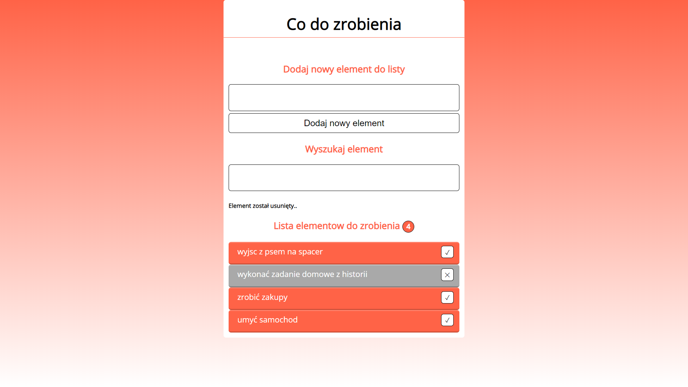

# js-todoapp
To do list, to do app 

## Technologies
JavaScript,
CSS

## General info
The application allows you to add elements, delete and change the status.
Project made as part of my JavaScript learning.

## Images
Full application

Item search option

active and completed (ready to delete) items

